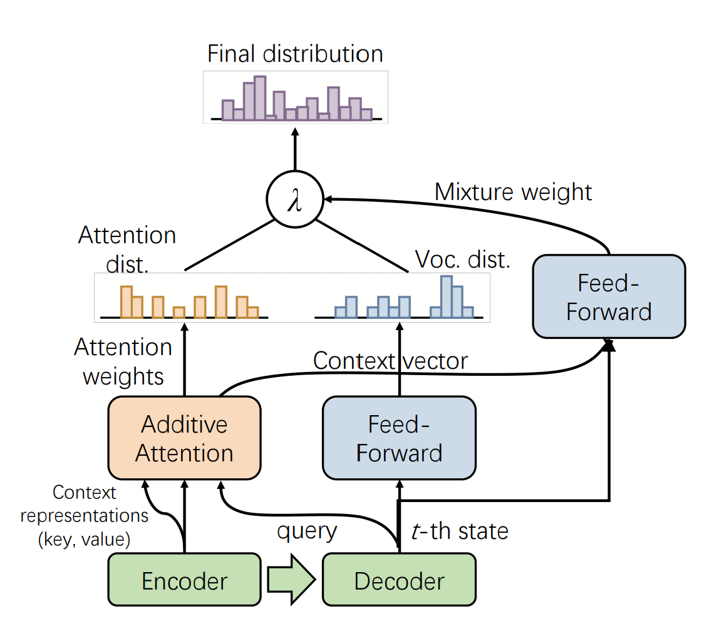

# Introduction
Source code for the paper: **PALM: Pre-training an Autoencoding&Autoregressive Language Model for Context-conditioned Generation** (Accepted by EMNLP 2020)



# Dependecies
- FairSeq version >= 1.0.0
- PyTorch version >= 1.0.0
- Python version >= 3.6
- export CFLAGS='-std=c99'

# Pre-Training with PALM (English)
## Download Pre-training Data
- Wikipedia Dump
```
wget https://dumps.wikimedia.org/enwiki/latest/enwiki-latest-pages-articles.xml.bz2 --no-check-certificate
python3 -m utils.process_wikicorpus
```
## Create Pre-training Data
```
python3 -m utils.create_pretraining_data_en /corpus/wiki
```
## Preprocess
Change the task name in the script(e.g. wikitext).
```
sh scripts/bpe_preprocess_en.sh
```
## Binarize
Change the task name in the script(e.g. wikitext).
```
sh scripts/palm-preprocess.sh
```
## Pre-Training
You can find a trainning experiment example [here](https://wandb.ai/wuchen/PALM/runs/36fta3sv/overview)
### DevCloud Machine
```
sh run_docker.sh mirrors.[docker image].com/minerva/hvdapex2:MINERVA_PALM 'sh /apdcephfs/private_chewu/PALM/scripts/palm-train.sh'
```
### Submit to Taiji
```
jizhi_client start -scfg /apdcephfs/private_chewu/PALM/jizhi/jizhi_palm_pretrain.json
```

# Pre-training with PALM (Chinese)
## Download Pre-training Data
- /apdcephfs/share_1351585/lucasxing/data/corpus.txt

## Create Pre-training Data
```
python3 -m utils.create_pretraining_data /apdcephfs/share_1351585/dataset
```
## Preprocess
Change the task name in the script(e.g. pretrain).
```
sh scripts/bpe-preprocess.sh
```

## Binarize
Change the task name in the script(e.g. pretrain).
```
sh scripts/palm-preprocess.sh
```

## Pre-Train
Change the data directory in the script(e.g. wikitext_bin)
```
sh run_docker.sh mirrors.[docker image].com/minerva/hvdapex2:MINERVA_PALM 'sh /apdcephfs/private_chewu/PALM/scripts/palm-train.sh'
```
Distributed training (e.g. replacing node_rank=0 with node_rank=1 on the second)
```
sh run_docker.sh mirrors.[docker image].com/minerva/hvdapex2:MINERVA_PALM 'sh /apdcephfs/private_chewu/PALM/scripts/palm-train.dist.sh'
```
<!-- You can find a trainning experiment example [here](https://wandb.ai/wuchen/PALM/runs/36fta3sv/overview) -->
Submit to Taiji
```
jizhi_client start -scfg /apdcephfs/private_chewu/PALM/jizhi/jizhi_dist.json
```

## Checkpoints
```
- /apdcephfs/share_1351585/FM/NLG/zh/palm_pretrain_checkpoints/checkpoint_best.pt
```

# Summary Task with PALM (Chinese)
## Datasets
- /apdcephfs/private_chewu/VLFM/video_summary/weibo_dataset

## Make datafiles
```
python3 -m utils.make_datafiles /apdcephfs/private_chewu/VLFM/video_summary/weibo_dataset
```

## BPE preprocess
```
sh scripts/bpe_preprocess_summary.sh
```

## Binarize dataset
```
sh scripts/preprocess_summary.sh
```

## Train without the pre-trained model
```
sh run_docker.sh mirrors.[docker image].com/minerva/hvdapex2:MINERVA_PALM 'sh scripts/palm_finetune_sum.sh'
```

## Tanslate pre-processed data with a fine-tuned model 
```
sh run_docker.sh mirrors.[docker image].com/minerva/hvdapex2:MINERVA_PALM 'sh scripts/palm_generate_sum.sh'
```

## Evaluation
```
python3 utils/score.py --rouge --gen_file /apdcephfs/private_chewu/video_summary/weibo_dataset/generate-test.txt
```

## Summarize
```
python3 -m utils.summarize --model-dir /apdcephfs/private_chewu/models/palm_finetune_weibo_checkpoints/ --src /apdcephfs/private_chewu/video_summary/weibo_dataset/test.source
```

# Package Checkpoints for Model Hub (Sample)
```
cd /apdcephfs/share_1351585/FM/NLG/zh/
tar -czf palm.base.tar.gz palm.base 
```

# Installation
We aim to minimize the dependency of this repo on other packages.  
We use fairseq as the main trainer (no models/datasets dependency on fairseq. We will support other trainer in future):  
```
git clone https://github.com/pytorch/fairseq
cd fairseq
pip3 install -e .  # also optionally follow fairseq README for apex installation for fp16 training.
export MKL_THREADING_LAYER=GNU  # fairseq may need this for numpy.
```

Then install this toolkit:
```
cd examples/PALM  # PALM can be in any folder, not necessarily under fairseq/examples.
pip3 install -e .
```

# Acknowledgments
We extended [Fairseq](https://github.com/pytorch/fairseq) to support PALM by adding *Auto_Encoding_Regressive* task, *PALM* model and *Label_Smoothed_Cross_Entropy_with_Masked_LM* criterion.

# Citation
Please cite as:
```
@article{bi2020palm,
  title={PALM: Pre-training an Autoencoding\&Autoregressive Language Model for Context-conditioned Generation},
  author={Bi, Bin and Li, Chenliang and Wu, Chen and Yan, Ming and Wang, Wei},
  journal={arXiv preprint arXiv:2004.07159},
  year={2020}
}
```