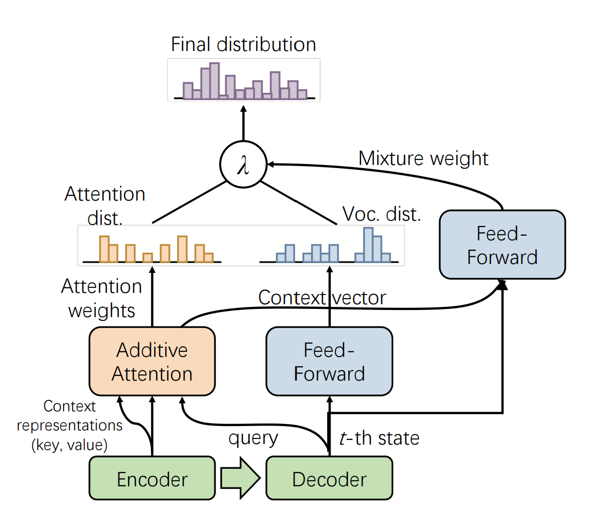

# Introduction
Source code for the paper: **PALM: Pre-training an Autoencoding&Autoregressive Language Model for Context-conditioned Generation** (Accepted by EMNLP 2020)



# Dependecies
- FairSeq version >= 1.0.0
- PyTorch version >= 1.0.0
- Python version >= 3.6

# CNN-DM Task with PALM
## Download [CNN-DM Data](https://github.com/abisee/cnn-dailymail)
- [CNN Stories](https://drive.google.com/uc?export=download&id=0BwmD_VLjROrfTHk4NFg2SndKcjQ)
- [DailyMail Stories](https://drive.google.com/uc?export=download&id=0BwmD_VLjROrfM1BxdkxVaTY2bWs)
<!--## Url lists
```
wget https://raw.githubusercontent.com/artmatsak/cnn-dailymail/master/url_lists/all_train.txt
wget https://raw.githubusercontent.com/artmatsak/cnn-dailymail/master/url_lists/all_test.txt
wget https://raw.githubusercontent.com/artmatsak/cnn-dailymail/master/url_lists/all_val.txt
```
-->
## Make datafiles
```
python -m utils.make_datafiles /datadrive/cnn/stories /datadrive/dailymail/stories
```
## BPE preprocess
```
wget -N 'https://dl.fbaipublicfiles.com/fairseq/gpt2_bpe/encoder.json'
wget -N 'https://dl.fbaipublicfiles.com/fairseq/gpt2_bpe/vocab.bpe'
wget -N 'https://dl.fbaipublicfiles.com/fairseq/gpt2_bpe/dict.txt'

sh scripts/bpe_preprocess.sh
```

## Binarize dataset
```
sh scripts/preprocess.sh
```

## Train without the pre-trained model
```
sh scripts/palm-train.sh
```
You can find a training experiment example [here](https://wandb.ai/wuchen/PALM/runs/3uosagk7)
<!--# Evaluate on the CNN-DM test dataset-->
<!--# Get pre-trained models from scrach-->

# Pre-training with PALM
## Download Pre-training Data
### [Wikipedia](https://s3.amazonaws.com/research.metamind.io/wikitext/wikitext-103-raw-v1.zip)
 ```
wget https://s3.amazonaws.com/research.metamind.io/wikitext/wikitext-103-raw-v1.zip
unzip wikitext-103-raw-v1.zip
 ```

## Create Pretraining Data
```
python3 -m utils.create_pretraining_data /bigdata/wikitext-103-raw
```
## Preprocess
Change the task name in the script(e.g. wikitext).
```
sh scripts/bpe-preprocess.sh
```
## Binarize
Change the task name in the script(e.g. wikitext).
```
sh scripts/palm-preprocess.sh
```
## Pre-Train
Change the data directory in the script(e.g. wikitext_bin)
```
sh scripts/palm-train.sh
```
You can find a trainning experiment example [here](https://wandb.ai/wuchen/PALM/runs/1foxq87a)

# Acknowledgments
We extended [Fairseq](https://github.com/pytorch/fairseq) to support PALM by adding *Auto_Encoding_Regressive* task, *PALM* model and *Label_Smoothed_Cross_Entropy_with_Masked_LM* criterion.

# Citation
Please cite as:
```
@article{bi2020palm,
  title={PALM: Pre-training an Autoencoding\&Autoregressive Language Model for Context-conditioned Generation},
  author={Bi, Bin and Li, Chenliang and Wu, Chen and Yan, Ming and Wang, Wei},
  journal={arXiv preprint arXiv:2004.07159},
  year={2020}
}
```
